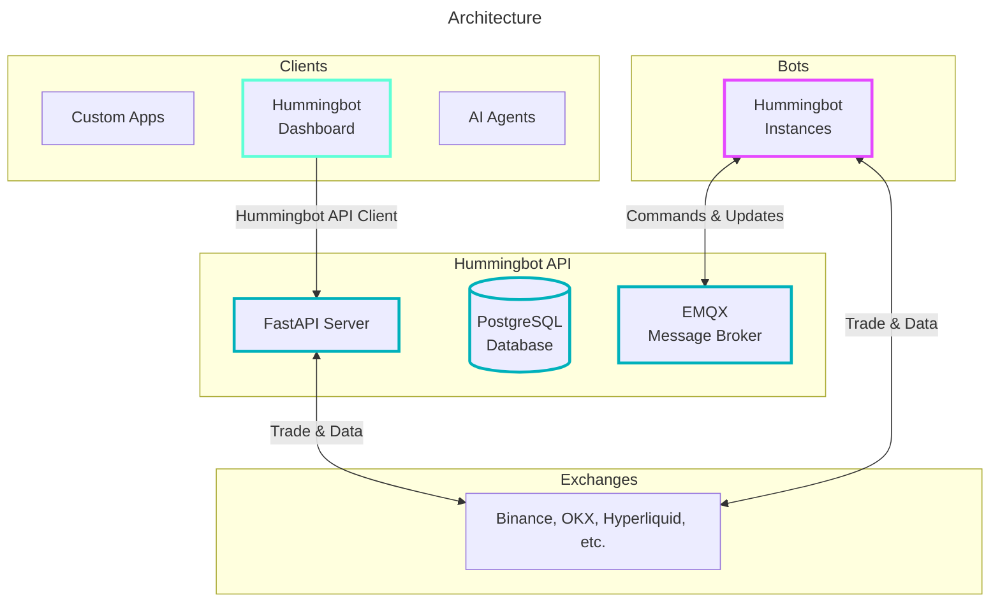

[Hummingbot](https://github.com/hummingbot/hummingbot) is an open-source framework that helps you design and deploy automated trading strategies, or bots, that can run on many centralized or decentralized exchanges. Over the past year, Hummingbot users have generated over $34 billion in trading volume across 140+ unique trading venues.

- https://hummingbot.org/
- https://github.com/hummingbot/

## Learn
- [Official Documentation](https://hummingbot.org/docs/)
  - https://hummingbot.org/guides/
- [Academy](https://hummingbot.org/blog/category/academy/)
  - [What is Market Making?](https://hummingbot.org/blog/what-is-market-making/)
  - [What is Arbitrage?](https://hummingbot.org/blog/what-is-arbitrage/)
  - [What is Inventory Risk?](https://hummingbot.org/blog/what-is-inventory-risk/)
  - [What is Cross Exchange Market Making?](https://hummingbot.org/blog/what-is-cross-exchange-market-making/)
  - [Liquidity Mining in Hummingbot vs DeFi](https://hummingbot.org/blog/liquidity-mining-in-hummingbot-vs-defi/), [Part-2](https://hummingbot.org/blog/liquidity-mining-in-hummingbot-vs-defi---part-2/)
- [Blog](https://hummingbot.org/blog/)
- https://github.com/hummingbot/hummingbot-site

### Installation
- [Installation Methods Comparison](https://hummingbot.org/installation/install-overview/)
  - Can I run multiple methods together?
    - Dashboard can manage Docker instances while you run separate source installations.
  - Which is most resource-efficient?
    - Docker standalone (no GUI overhead), followed by Source.
  - How to switch versions?
    - Dashboard: Automatic through UI
    - Docker: Edit `image:` tag
    - Source: `git checkout` tags
- [Hummingbot V2 + Dashboard](https://hummingbot.org/installation/)
  - `git clone https://github.com/hummingbot/deploy.git; cd deploy`
  - `bash setup.sh`
- [Install via Docker](https://hummingbot.org/installation/docker/)
  - `git clone https://github.com/hummingbot/hummingbot.git; cd hummingbot`
  - `docker compose up -d`
  - `docker attach hummingbot`
- [Install from Source](https://hummingbot.org/installation/source/)
  - Install Dependencies, Anaconda
  - `git clone https://github.com/hummingbot/hummingbot.git; cd hummingbot`
  - `./install`
  - `conda activate hummingbot`
  - `./compile`
  - `./start`

### [Hummingbot Client](https://hummingbot.org/client/)
- [Hummingbot Docker Quickstart Guide](https://hummingbot.org/blog/hummingbot-docker-quickstart-guide/)

## [Hummingbot Dashboard](https://hummingbot.org/dashboard/)
- [Hummingbot Dashboard Quickstart Guide](https://hummingbot.org/blog/hummingbot-dashboard-quickstart-guide/)
- Web-based interface built on top of Hummingbot API
  - Accessible Framework: Uses the Streamlit open source data visualization framework
  - Backtestable Strategies: Configure and backtest strategy controllers
  - Multi-Bot Deployment: Deploy and manage multiple bot instances and monitor their real-time performance
  - API-Powered: Built on top of the new Hummingbot API for reliable bot management

## [Hummingbot API](https://hummingbot.org/hummingbot-api/)
- [Hummingbot API Quickstart Guide](https://hummingbot.org/hummingbot-api/quickstart/)

## [Quants Lab](https://hummingbot.org/quants-lab/)
Quants Lab contains interactive notebooks and task schedulers for quantitative trading research and development. 
It provides comprehensive tools for data collection, backtesting, strategy development, and automated task management.

## Resources
- [Awesome Hummingbot](https://github.com/hummingbot/awesome-hummingbot) is a community-driven project, provided as a resource for users to familiarize themselves with Hummingbot, the open source framework for building high-frequency crypto trading bots. This repository is maintained by Hummingbot Foundation, and everyone is invited to contribute.
