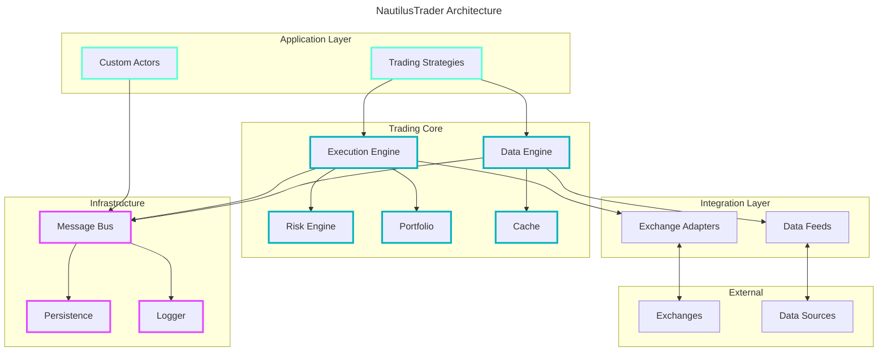

[NautilusTrader](https://nautilustrader.io/) is a high-performance algorithmic trading platform and event-driven backtester written in Rust and Python. 
It provides a professional-grade trading framework with ultra-low latency execution, supporting both cryptocurrency and traditional markets across multiple venues.

- https://nautilustrader.io/
- https://github.com/nautechsystems/nautilus_trader

- [[blockchain]]
- [[finance]]
  - [[trading]]
    - [[high-frequency-trading]]
- [[python]], [[rust]]


## Learn
- [Official Documentation](https://nautilustrader.io/docs/) - Comprehensive guide to installation, architecture, and trading strategies
- [Getting Started](https://nautilustrader.io/docs/getting-started/) - Quick introduction to NautilusTrader
- [User Guide](https://nautilustrader.io/docs/user-guide/) - Detailed user documentation
- [API Reference](https://nautilustrader.io/docs/api-reference/) - Complete API documentation
- [Developer Guide](https://nautilustrader.io/docs/developer-guide/) - Contributing and extending the platform

### Blogs
- [Blog](https://nautilustrader.io/blog/) - Official blog with updates and tutorials
- [Medium Articles](https://medium.com/@nautilustrader) - Technical articles and insights

### Communities
- [Discord Community](https://discord.gg/AUWFCHthgs) - Active community for support and discussions
- [GitHub Discussions](https://github.com/nautechsystems/nautilus_trader/discussions) - Technical discussions and Q&A
- [r/algotrading](https://www.reddit.com/r/algotrading/) - General algorithmic trading discussions


## Quick Start
A minimal example to get started with NautilusTrader:

```python
from nautilus_trader.backtest.engine import BacktestEngine
from nautilus_trader.backtest.engine import BacktestEngineConfig
from nautilus_trader.examples.strategies.ema_cross import EMACross
from nautilus_trader.model.currencies import USD

# Configure backtest engine
config = BacktestEngineConfig(
    trader_id="BACKTESTER-001",
    log_level="INFO"
)

# Create backtest engine
engine = BacktestEngine(config=config)

# Add a strategy
strategy = EMACross(
    instrument_id="EUR/USD.IDEALPRO",
    bar_type="EUR/USD.IDEALPRO-1-MINUTE-BID",
    fast_ema_period=10,
    slow_ema_period=20,
)
engine.add_strategy(strategy)

# Add data and run
engine.add_instrument("EUR/USD.IDEALPRO")
engine.run()

# Analyze results
engine.trader.generate_account_report()
```

For more examples, see [Example Notebooks](https://github.com/nautechsystems/nautilus_trader/tree/develop/examples/notebooks).


## [Installation](https://nautilustrader.io/docs/getting-started/installation/)
- [Installation Methods Comparison](https://nautilustrader.io/docs/getting-started/installation/)
  - Which method is best for production?
    - Source installation for ultimate control and performance
  - Which is easiest to get started?
    - PyPI installation: `pip install -U nautilus_trader`
  - How to switch versions?
    - PyPI: `pip install nautilus_trader==<version>`
    - Source: `git checkout` tags

### Install from PyPI (Recommended for beginners)
```bash
pip install -U nautilus_trader
```

### Install from Source (Recommended for development)
```bash
git clone https://github.com/nautechsystems/nautilus_trader.git
cd nautilus_trader
make install
```

### Install via Docker
```bash
docker pull ghcr.io/nautechsystems/nautilus_trader:latest
docker run -it nautilus_trader
```

### System Requirements
- Python 3.10+
- Rust (for building from source)
- Redis (optional, for distributed systems)
- Platform Support
  - Linux (recommended for production)
  - macOS
  - Windows (via WSL2)


## [Configuration](https://nautilustrader.io/docs/user-guide/configuration/)
- [Strategy Configuration](https://nautilustrader.io/docs/user-guide/strategies/) - Configure trading strategies and parameters
- [Data Configuration](https://nautilustrader.io/docs/user-guide/data/) - Set up data providers and historical data
- [Execution Configuration](https://nautilustrader.io/docs/user-guide/execution/) - Configure order execution and risk management
- [Logging Configuration](https://nautilustrader.io/docs/user-guide/logging/) - Set up logging for debugging and monitoring


## [Integrations](https://nautilustrader.io/docs/integrations/)
- [Exchange-specific Notes](https://nautilustrader.io/docs/integrations/) - Information on supported exchanges and their configurations
- Supported Venues
  - **Crypto**: Binance, Bybit, OKX, dYdX, Kraken, Coinbase, etc.
  - **Traditional**: Interactive Brokers
  - **Data Providers**: Custom adapters for various data sources
- [Custom Adapters](https://nautilustrader.io/docs/developer-guide/adapters/) - Build adapters for new exchanges or data providers


## [Strategies](https://nautilustrader.io/docs/user-guide/strategies/)
- [Strategy Development](https://nautilustrader.io/docs/user-guide/strategies/developing/) - Learn how to create custom trading strategies
- [Order Management](https://nautilustrader.io/docs/user-guide/strategies/orders/) - Managing orders within strategies
- [Risk Management](https://nautilustrader.io/docs/user-guide/strategies/risk/) - Implementing risk controls
- [Portfolio Management](https://nautilustrader.io/docs/user-guide/strategies/portfolio/) - Multi-asset portfolio strategies

### Strategy Examples
- [Example Strategies](https://github.com/nautechsystems/nautilus_trader/tree/develop/examples/strategies) - Collection of example strategies in the official repository
- Strategy Types
  - Market making
  - Arbitrage
  - Momentum
  - Mean reversion
  - Pairs trading


## [Backtesting](https://nautilustrader.io/docs/user-guide/backtesting/)
- [Backtesting Engine](https://nautilustrader.io/docs/user-guide/backtesting/engine/) - High-fidelity event-driven backtesting
- [Data Management](https://nautilustrader.io/docs/user-guide/data/) - Loading and managing historical data for backtesting
- [Performance Analysis](https://nautilustrader.io/docs/user-guide/backtesting/analysis/) - Analyzing backtest results and performance metrics
- Key Features
  - Event-driven architecture for accurate simulation
  - Multi-venue and multi-asset support
  - Order book simulation with configurable fill models
  - Latency simulation
  - Transaction cost modeling
  - High-resolution tick data support
- [Assumptions and Limitations](https://nautilustrader.io/docs/user-guide/backtesting/considerations/) - Understanding backtesting limitations
- :warning: Best Practices
  - Use high-quality tick data for accurate results
  - Account for realistic slippage and transaction costs
  - Model market impact for large orders
  - Test across different market conditions
  - Validate results with walk-forward analysis
  - Be aware of look-ahead bias in indicator calculations
  - Use proper train/test splits to avoid overfitting


## [Live Trading](https://nautilustrader.io/docs/user-guide/live-trading/)
- [Paper Trading](https://nautilustrader.io/docs/user-guide/live-trading/paper/) - Test strategies with simulated funds
- [Live Deployment](https://nautilustrader.io/docs/user-guide/live-trading/deployment/) - Deploy strategies for live trading
- [Monitoring](https://nautilustrader.io/docs/user-guide/monitoring/) - Monitor running strategies and system health
- [Risk Controls](https://nautilustrader.io/docs/user-guide/strategies/risk/) - Pre-trade and post-trade risk management


## Control the Bot
- [Commands](https://nautilustrader.io/docs/user-guide/commands/) - Command interface for controlling trading instances
- [REST API](https://nautilustrader.io/docs/api-reference/rest/) - RESTful API for programmatic control
- [WebSocket API](https://nautilustrader.io/docs/api-reference/websocket/) - Real-time streaming data and commands
- [Logging and Monitoring](https://nautilustrader.io/docs/user-guide/logging/) - System logs and performance monitoring


## Architecture



## Performance
- **Low Latency**: Sub-microsecond event processing with Rust core
- **High Throughput**: Handles millions of events per second
- **Memory Efficient**: Optimized memory usage with zero-copy operations
- **Scalability**: Horizontal scaling with distributed architecture

### Performance Optimization Tips
- Compile with `--release` flag for production
- Use Parquet format for efficient data storage and retrieval
- Configure cache size based on available memory
- Enable Redis for distributed caching
- Use colocation or low-latency hosting for [[high-frequency-trading]]
- Profile strategies with built-in performance monitoring tools


## Advanced Features
- [Custom Indicators](https://nautilustrader.io/docs/user-guide/indicators/) - Create and use custom technical indicators
- [Data Aggregation](https://nautilustrader.io/docs/user-guide/data/aggregation/) - Multi-timeframe and custom bar aggregation
- [Distributed Systems](https://nautilustrader.io/docs/developer-guide/distributed/) - Deploy across multiple machines
- [Machine Learning Integration](https://nautilustrader.io/docs/user-guide/ml/) - Integrate ML models into trading strategies


## Data Management
- [Historical Data](https://nautilustrader.io/docs/user-guide/data/historical/) - Download and manage historical market data
- [Data Catalog](https://nautilustrader.io/docs/user-guide/data/catalog/) - Organize and query large datasets efficiently
- Supported Data Formats
  - Parquet (recommended for production)
  - CSV
  - Custom formats via adapters
- Data Sources
  - Exchange historical data
  - Third-party data providers
  - Custom data feeds


## Libraries and Dependencies
- Core Technologies
  - [[rust]] - High-performance core engine
  - [[python]] - Strategy development and API
  - [Cython](https://github.com/cython/cython) - Performance-critical Python extensions
  - [msgpack](https://msgpack.org/) - Efficient serialization
  - [Redis](https://redis.io/) - Optional distributed caching
- Data Science Stack
  - [pandas](https://pandas.pydata.org/) - Data manipulation
  - [NumPy](https://numpy.org/) - Numerical computing
  - [TA-Lib](https://ta-lib.org/) - Technical analysis indicators
- Networking
  - [aiohttp](https://docs.aiohttp.org/) - Async HTTP client/server
  - [websockets](https://websockets.readthedocs.io/) - WebSocket protocol


## Use Cases
- **High-Frequency Trading**: Ultra-low latency execution for HFT strategies
- **Market Making**: Automated market making with order book support
- **Statistical Arbitrage**: Multi-asset statistical arbitrage strategies
- **Portfolio Management**: Institutional-grade portfolio management
- **Research and Development**: Professional backtesting and strategy research
- **Crypto Trading**: Multi-exchange cryptocurrency trading
- **Traditional Markets**: Stocks, futures, options via Interactive Brokers


## Tools and Integrations
- **Data Visualization**: Integration with [TradingView](https://www.tradingview.com/) for charting
- **Data Analysis**: Compatible with Jupyter notebooks for analysis
- **Monitoring**: Grafana and Prometheus for system monitoring
- **Alerting**: Webhook support for trade notifications
- **Version Control**: Git-friendly configuration and strategy code
- **CI/CD**: Docker support for continuous deployment


## Comparison with Other Platforms

| Feature | NautilusTrader | [[freqtrade]] | [[hummingbot]] |
|---------|----------------|-----------|------------|
| Language | Rust + Python | Python | Python |
| Performance | Ultra-high | Medium | Medium-High |
| Backtesting | Event-driven | Vectorized | Limited |
| Live Trading | Yes | Yes | Yes |
| Traditional Markets | Yes | No | Limited |
| Order Book Support | Full Level 2/3 | Limited | Yes |
| Latency | Sub-microsecond | Millisecond | Millisecond |
| Learning Curve | High | Medium | Medium |
| Setup Complexity | High | Low-Medium | Medium |
| Community Size | Growing | Large | Medium |
| Best For | HFT, Professional | Crypto automation | Market making |
| Documentation | Excellent | Excellent | Good |


## FAQs
- [Frequently Asked Questions](https://nautilustrader.io/docs/faq/)
- Install on macOS x86_64
  - `export RUSTFLAGS="-C link-arg=-Wl,-undefined,dynamic_lookup"`
  - `uv pip install nautilus_trader`
- Common Issues
  - **Performance**: Ensure compiled with release mode for production
  - **Data**: Use Parquet format for efficient historical data storage
  - **Memory**: Configure cache settings based on available RAM
  - **Latency**: Use colocation or proximity hosting for ultra-low latency
  - **Installation**: Build from source may take 10-30 minutes due to Rust compilation
  - **Python Version**: Requires Python 3.10+, not compatible with older versions
  - **Windows**: Best experience through WSL2, native Windows support is limited


## Resources
- [GitHub Repository](https://github.com/nautechsystems/nautilus_trader) - Main source code repository
- [GitHub topic of NautilusTrader tag](https://github.com/topics/nautilus-trader)
- [Discord Community](https://discord.gg/AUWFCHthgs) - Active community for support and discussions
- [Example Notebooks](https://github.com/nautechsystems/nautilus_trader/tree/develop/examples/notebooks) - Jupyter notebooks with tutorials
- [Example Strategies](https://github.com/nautechsystems/nautilus_trader/tree/develop/examples/strategies) - Reference strategy implementations
- [Video Tutorials](https://www.youtube.com/@nautilustrader) - Official YouTube channel
- [Awesome Quant](https://github.com/wilsonfreitas/awesome-quant) - Curated list of quantitative finance libraries
- [Awesome Systematic Trading](https://github.com/wangzhe3224/awesome-systematic-trading) - Systematic trading resources
- Comparison Resources
  - vs [[freqtrade]] - More crypto-focused with simpler setup
  - vs [[hummingbot]] - More market-making focused with visual dashboard
  - vs QuantConnect/LEAN - Similar professional-grade platform
